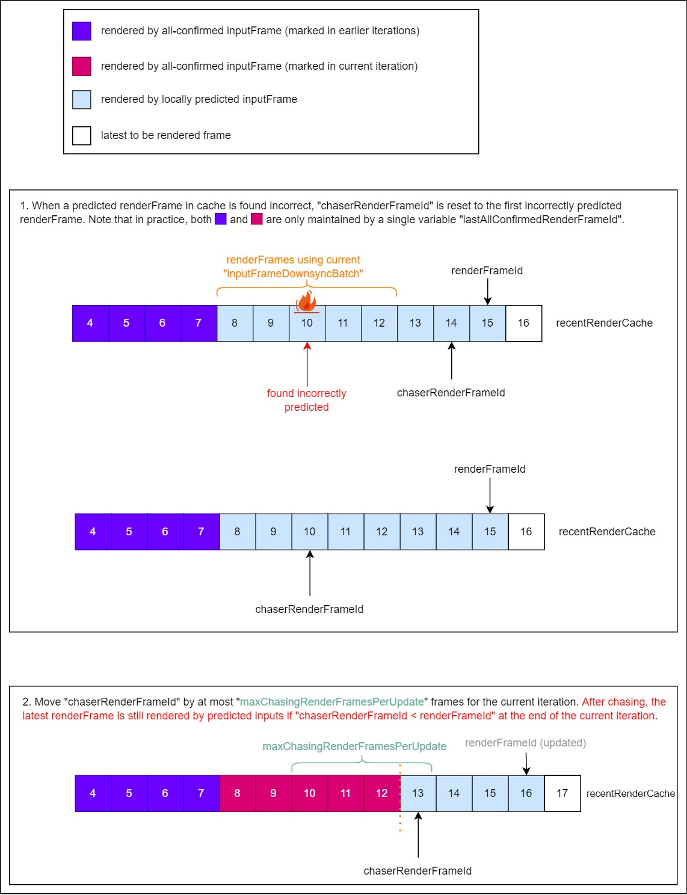

# Preface 

This project is a demo for a websocket-based rollback netcode inspired by [GGPO](https://github.com/pond3r/ggpo/blob/master/doc/README.md). As lots of feedbacks ask for a discussion on using UDP instead, I tried to summarize my personal opinion about it in [ConcerningEdgeCases](./ConcerningEdgeCases.md) -- not necessarily correct but that's indeed a question to face :)

The following video is recorded over INTERNET using an input delay of 4 frames and it feels SMOOTH when playing! Please also checkout these demo videos
- [source video of the first gif](https://pan.baidu.com/s/1ML6hNupaPHPJRd5rcTvQvw?pwd=8ruc) 
- [phone v.s. PC over internet battle#1](https://pan.baidu.com/s/1NuGxuMwrV_jalcToyUZPLg?pwd=kfkr) 
- [phone v.s. PC over internet battle#2](https://pan.baidu.com/s/1kMiFdwDHyJpZJ0GGU1Y3eA?pwd=46gd) 
- [PC Wifi viewing Phone 4g](https://pan.baidu.com/s/1PJEtC9iB_fcabMWhbx2oAg?pwd=tp7k) 
- [PC Wifi viewing Phone Wifi (over internet of course)](https://pan.baidu.com/s/108rvC1CcUdiQeMauXWsLJg?pwd=mn39) 

to see how this demo carries out a full 60fps synchronization with the help of _batched input upsync/downsync_ for satisfying network I/O performance.


All gifs are sped up to ~1.5x for file size reduction, kindly note that animations are resumed from a partial progress!

# Notable Features
- Backend dynamics toggle via [Room.BackendDynamicsEnabled](https://github.com/genxium/DelayNoMore/blob/v0.9.14/battle_srv/models/room.go#L786)
- Recovery upon reconnection (only if backend dynamics is ON)
- Automatically correction for "slow ticker", especially "active slow ticker" which is well-known to be a headache for input synchronization
- Frame data logging toggle for both frontend & backend, useful for debugging out of sync entities when developing new features

_(how input delay roughly works)_


_(how rollback-and-chase in this project roughly works, kindly note that by the current implementation, each frontend only maintains a `lastAllConfirmedInputFrameId` for all the other peers, because the backend only downsyncs all-confirmed inputFrames, see [markConfirmationIfApplicable](https://github.com/genxium/DelayNoMore/blob/v0.9.14/battle_srv/models/room.go#L1085) for more information -- if a serverless peer-to-peer communication is seriously needed here, consider porting [markConfirmationIfApplicable](https://github.com/genxium/DelayNoMore/blob/v0.9.14/battle_srv/models/room.go#L1085) into frontend for maintaining `lastAllConfirmedInputFrameId` under chaotic reception order of inputFrames from peers)_




(By use of [GopherJs](https://github.com/gopherjs/gopherjs), the frontend codes for dynamics are now automatically generated)


# 1. Building & running

## 1.1 Tools to install 
### Backend
- [Command Line Tools for Xcode](https://developer.apple.com/download/all/?q=command%20line%20tools) (on OSX) or [TDM-GCC](https://jmeubank.github.io/tdm-gcc/download/) (on Windows) (a `make` executable mandatory)
- [Golang1.18.6](https://golang.org/dl/) (brought down to 1.18 for _GopherJs_ support, mandatory, in China please try a mirror site like [that of ustc](https://mirrors.ustc.edu.cn/golang/))
- [GopherJs1.18.0-beta1](https://github.com/gopherjs/gopherjs/tree/v1.18.0-beta1) (optional, only for developemnt)
- [MySQL 5.7](https://dev.mysql.com/downloads/windows/installer/5.7.html) (mandatory, for OSX not all versions of 5.7 can be found thus 5.7.24 is recommended)
- [Redis 3.0.503 or above](https://redis.io/download/) (mandatory)
- [skeema](https://www.skeema.io/) (optional, only for convenient MySQL schema provisioning)
- [protobuf CLI](https://developers.google.com/protocol-buffers/docs/downloads) (optional, only for development)

### Frontend
- [CocosCreator v2.2.1](https://www.cocos.com/en/cocos-creator-2-2-1-released-with-performance-improvements) (mandatory, **ONLY AVAILABLE on Windows or OSX and should be exactly this version**, DON'T use any other version because CocosCreator is well-known for new versions not being backward compatible)
- [protojs](https://www.npmjs.com/package/protojs) (optional, only for development)

## 1.2 Provisioning
### Backend/Database
It's strongly recommended that `skeema` is used for provisioning [the required schema](https://github.com/genxium/DelayNoMore/tree/main/database/skeema-repo-root) in MySQL instance. When using `skeema` the steps are as follows.
```
### Mandatory after an initial clone
user@proj-root/database/skeema-repo-root> cp .skeema.template .skeema

### Mandatory
user@proj-root/database/skeema-repo-root> skeema push
```

On `Windows 10/11`, you can compile `skeema` from source and config the host to be `127.0.0.1` instead of `localhost` to use it, i.e. circumventing the pitfall for MySQL unix socket connection on Windows.

### Backend/Golang
```
user@proj-root/battle_srv/configs> cp -r ./configs.template ./configs
```

### Frontend
```
user@proj-root/frontend/assets/plugin_scripts> cp ./conf.js.template ./conf.js
```

## 1.3 Actual building & running
### Backend 
```
### The following command runs mysql-server in foreground, it's almost NEVER run in such a way, please find a proper way to run it for yourself
user@anywhere> mysqld

### The following command runs redis-server in foreground, it's OK to put it in background
user@anywhere> redis-server

### on Windows using TDM-GCC: mingw32-make run-test 
user@proj-root/battle_srv> make run-test
```

### Frontend
The easy way is to try out 2 players with test accounts on a same machine.
- Open CocosCreator v2.2.1 (mandatory, it serves the web content of the following steps)
- Open one browser instance, visit _http://localhost:7456?expectedRoomId=1_, input `add`on the username box and click to request a captcha, this is a test account so a captcha would be returned by the backend and filled automatically (as shown in the figure below), then click and click to proceed to a matching scene.
- Open another browser instance, visit _http://localhost:7456?expectedRoomId=1_, input `bdd`on the username box and click to request a captcha, this is another test account so a captcha would be returned by the backend and filled automatically, then click and click to proceed, when matched a `battle`(but no competition rule yet) would start.
- Try out the onscreen virtual joysticks to move the cars and see if their movements are in-sync.


## 2 Troubleshooting

### 2.1 Redis snapshot writing failure
```
ErrFatal        {"err": "MISCONF Redis is configured to save RDB snapshots, but is currently not able to persist on disk. Commands that may modify the data set are disabled. Please check Redis logs for details about the error."}
```

Just restart your `redis-server` process.

### 2.2 Why not show "PING value" on frontend display? 
The most important reason for not showing "PING value" is simple: in most games the "PING value" is collected by a dedicated kernel thread which doesn't interfere the UI thread or the primary networking thread. As this demo primarily runs on browser by far, I don't have this capability easily.

Moreover, in practice I found that to spot sync anomalies, the following tools are much more useful than the "PING VALUE".  
- Detection of [prediction mismatch on the frontend](https://github.com/genxium/DelayNoMore/blob/v0.9.19/frontend/assets/scripts/Map.js#L842).
- Detection of [type#1 forceConfirmation on the backend](https://github.com/genxium/DelayNoMore/blob/v0.9.19/battle_srv/models/room.go#L1246).
- Detection of [type#2 forceConfirmation on the backend](https://github.com/genxium/DelayNoMore/blob/v0.9.19/battle_srv/models/room.go#L1259).
